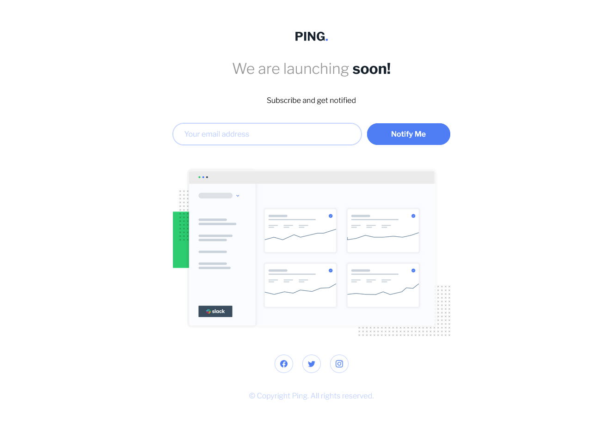

# Frontend Mentor - Ping coming soon page solution

This is my solution to the Frontend Mentor "Ping: Single-column coming soon page" challenge. I built a responsive, single-column coming-soon page with client-side email validation and clear form error states.

## Table of contents

- [Frontend Mentor - Ping coming soon page solution](#frontend-mentor---ping-coming-soon-page-solution)
  - [Table of contents](#table-of-contents)
  - [Overview](#overview)
    - [The challenge](#the-challenge)
    - [Screenshot](#screenshot)
    - [Links](#links)
  - [My process](#my-process)
    - [Built with](#built-with)
    - [What I learned](#what-i-learned)
    - [Continued development](#continued-development)
    - [Useful resources](#useful-resources)
  - [Author](#author)
  - [Acknowledgments](#acknowledgments)

## Overview

### The challenge

Users should be able to:

- View the optimal layout for the site depending on their device's screen size
- See hover states for all interactive elements on the page
- Submit their email address using an `input` field
- Receive an error message when the `form` is submitted if:
	- The `input` field is empty. Message: "Whoops! It looks like you forgot to add your email"
	- The email address is not formatted correctly. Message: "Please provide a valid email address"

### Screenshot



### Links

- Solution URL: [Add solution URL here](https://github.com/rabbitmaid/fem-ping-coming-soon-page)
- Live Site URL: [View live project](https://rabbitmaid.github.io/fem-ping-coming-soon-page/)

## My process

### Built with

- Semantic HTML5
- CSS3 (custom properties, flexbox)
- Mobile-first responsive layout
- Vanilla JavaScript for form handling and validation
- Local webfonts (Libre Franklin)

### What I learned

- Implementing a clean, single-column responsive layout that adapts between mobile and desktop widths.
- Building accessible form validation patterns and showing helpful error messages for users.
- Using CSS custom properties and utility classes to keep styles consistent.

Example simple email validation function used in the project:

```js
function validateEmail(email) {
    const emailRegex = /^[a-zA-Z0-9._%+-]+@[a-zA-Z0-9.-]+\.[a-zA-Z]{2,}$/;
    return emailRegex.test(email);
}
```

### Continued development

- Add progressive enhancement for users without JavaScript (server-side validation or `novalidate` fallback).
- Improve animations and transitions for better perceived performance.
- Add unit/visual tests and refine accessibility (ARIA attributes, keyboard focus styles).

### Useful resources

- Frontend Mentor challenge: https://www.frontendmentor.io/challenges/ping-single-column-coming-soon-page-5cadd051fec04111f7b848da
- MDN Web Docs — Forms and validation: https://developer.mozilla.org/
- CSS-Tricks — Responsive design techniques: https://css-tricks.com/

## Author

- Name — Mr Rabbit
- Frontend Mentor — [@rabbitmaid](https://www.frontendmentor.io/profile/rabbitmaid)

## Acknowledgments

Thanks to the Frontend Mentor community for the challenge and design inspiration.

